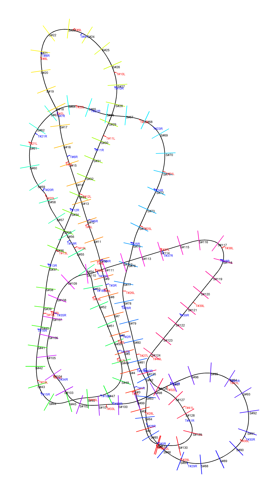

# Gingerbread Coaster Creator
This is a program that takes a CSV of track data from a roller coaster. (Possibly created with a program like No Limits 2) and creates paper templates to create molds for Twizzlers and cutouts for Graham Crackers from. Then you can construct your rollercoaster as a gingerbread coaster.

## Example

The rainbow colored supports are where Graham Crackers should go, and the red and blue smaller markers mark where individual Twizzlers should start and end.

Final layout for Wildcat's Revenge:

Example base cutouts:

Example height cutouts:
